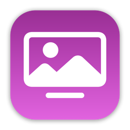
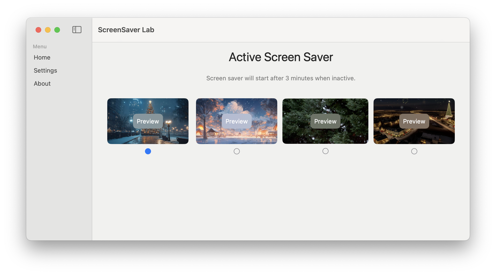

# ScreenSaver Lab

A customizable screensaver application for macOS that displays screensaver when your computer is inactive.

## Preview

## Screen Recording

## Download

[Download ScreenSaver Lab](https://github.com/tranhuycong/ScreenSaverLab/releases/download/v1.0.4/ScreenSaverLab-v1.0.4.dmg)

## All Releases

[View all releases](https://github.com/tranhuycong/ScreenSaverLab/releases)

## Features

- Play video screensavers
- Configurable inactivity timeout (1-60 minutes)
- Multiple video support with preview thumbnails
- Automatic display sleep detection
- Menu bar quick access

## Requirements

- macOS 13.5 or later

## Installation

1. Download the latest release
2. Open the .app file
3. The app will appear in your menu bar

## Usage

### Basic Settings

- Click the menu bar icon to instantly start the screensaver
- Access settings to:
  - Enable/disable screensaver
  - Adjust inactivity timeout
  - Select video content

### Video Selection

The app comes with preloaded video content that can be selected from the Home view. Each video shows a preview thumbnail and can be selected with the radio button below it.
